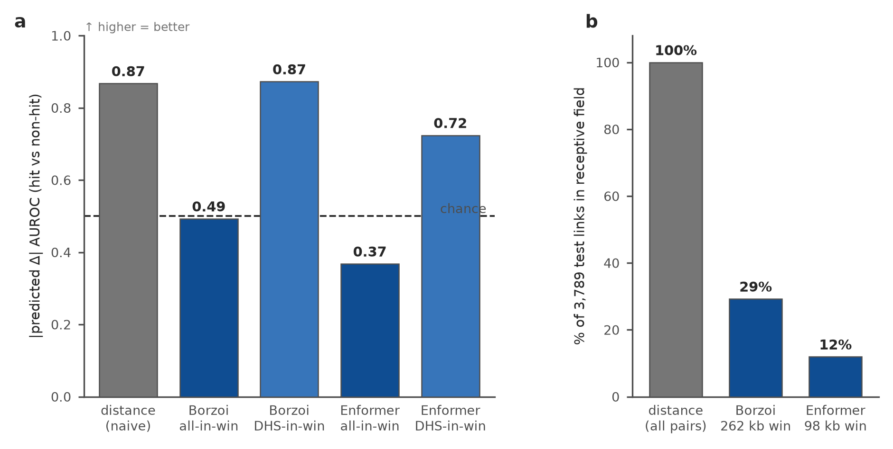
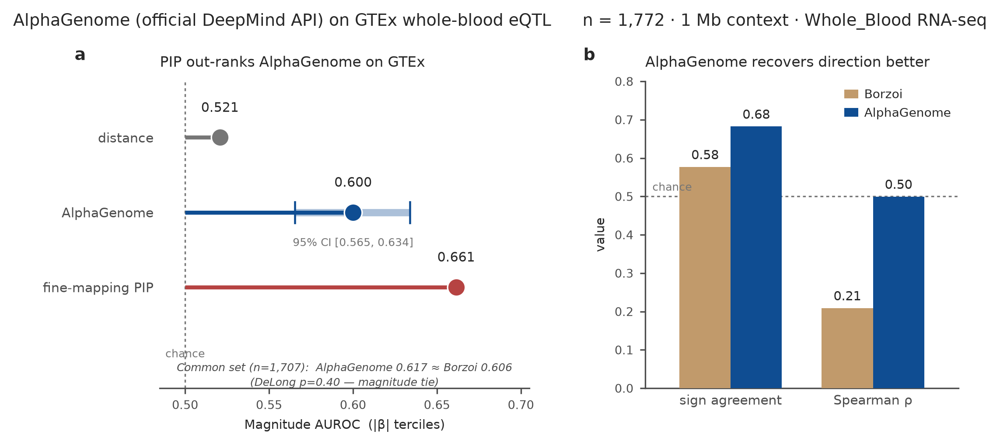
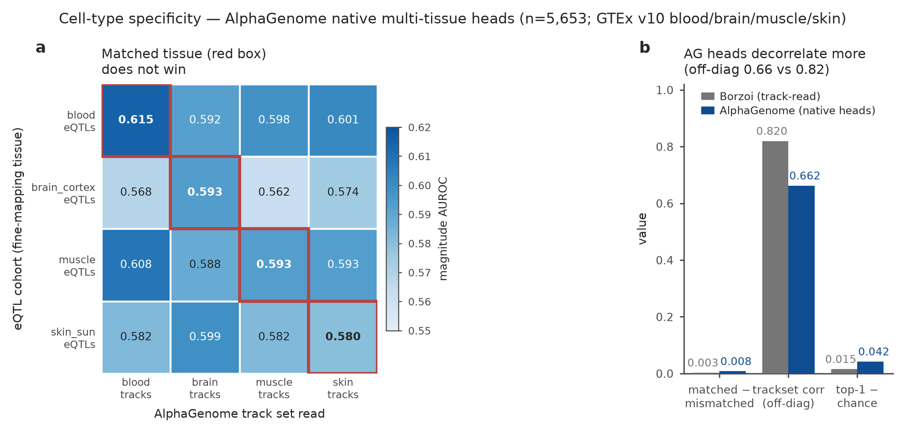
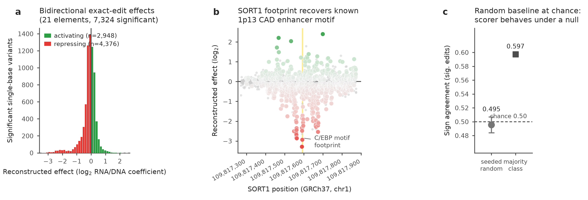
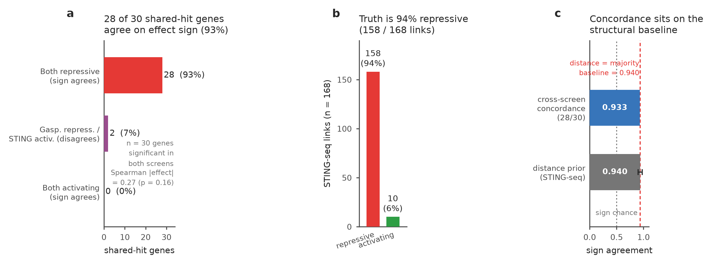
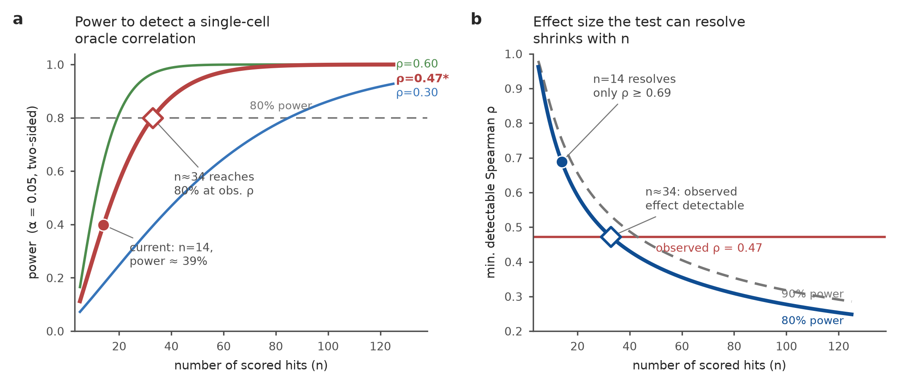

# CIS-Δ &nbsp;·&nbsp; PerturbExpression

**Do DNA sequence models actually predict the *change in expression* a real *cis*-regulatory perturbation produces?**
*A perturbation-grounded benchmark that scores predicted Δ against experimental ground truth — and against a naive genomic baseline.*

&nbsp;

[**📄 Full Paper (PDF)**](CIS-Delta_paper.pdf) &nbsp;·&nbsp; [**📊 Leaderboard**](docs/leaderboard.md) &nbsp;·&nbsp; [**📋 Executive Summary**](docs/CIS-Delta_executive_summary.md) &nbsp;·&nbsp; [**📚 References**](docs/references.md)

---

## The problem

Two fields are converging on one goal: sequence-to-expression **"oracles"** (Enformer, Borzoi, AlphaGenome, Evo2) and the **generative-DNA designers** built on top of them. Both aim to predict — or engineer — how *cis*-regulatory DNA sets a gene's expression.

Yet neither is routinely scored on the quantity that matters for regulatory therapeutics: the **change in expression (Δ)** a real perturbation produces, measured against experimental ground truth *and* compared against a naive baseline. Designers are typically evaluated by the very oracle that guided them (circular), or on episomal reporters stripped of native chromatin. **CIS-Δ closes that gap** — it scores a model's predicted Δ for a *(cell-context, intervention)* pair against measured Δ, across seven assay axes, under one metric.

> A submission is one file of predicted Δ keyed by `pair_id`. The scorer runs **seven assay axes under one metric**, with bootstrap 95% confidence intervals and DeLong tests.

| | |
|---|---|
| **What it measures** | predicted Δ for a *(cell context, cis-intervention)* pair vs measured Δ |
| **Metric** | direction / magnitude AUROC, calibration, coverage — bootstrap 95% CIs, DeLong |
| **Baselines** | distance-to-TSS, ABC, ENCODE-rE2G, statistical fine-mapping (PIP) |
| **Axes** | 5 established/reference + 2 exploratory breadth extensions (7 total) |

---

## The headline result

*Left: on pooled K562 CRISPRi Δ, a naive distance-to-TSS ruler matches or beats both published oracles; Borzoi and Enformer only recover distal enhancers on the DHS-in-window subset they can actually see, and collapse when pooled. Right: the receptive field excludes most measured regulatory links.*

On the pooled K562 CRISPRi benchmark, a **naive distance-to-TSS baseline out-ranks Borzoi and Enformer** (direction AUROC **0.868** for distance vs Borzoi 0.49 / Enformer 0.37 all-pairs; the link-prior baselines ENCODE-rE2G 0.82 and ABC 0.81 also clear both oracles). On fine-mapped eQTLs, an **outcome-informed fine-mapping reference out-ranks AlphaGenome** (PIP 0.688 vs 0.624 — PIP is *not* a sequence-only baseline).

The models are **not useless.** On the distal enhancers they *can* see, Borzoi recovers direction on the in-window DHS subset (AUROC **0.873** > distance 0.750 on that subset; the gap is not significant after correction, DeLong q=0.099), and on eQTLs both AlphaGenome and Borzoi clear the distance prior. But related **calibration and coverage gaps recur across model families and evaluation tracks**: most real regulatory links fall outside the receptive field (**71% for Borzoi, 88% for Enformer**), and aggregate performance collapses once promoter-proximal controls are included. Even AlphaGenome — the 2026 state of the art — does not close the coverage/calibration gap.

---

## What CIS-Δ measures — the five-axis metric package

A single predicted-Δ submission is scored on five complementary axes of behaviour, so a model that "looks right" on one dimension can't hide a failure on another:

| Axis | Question it answers |
|---|---|
| **Direction** | Does the model get the *sign* of the response (up vs down) right? |
| **Magnitude calibration** | Is the *size* of predicted Δ calibrated to the measured effect? |
| **Single-cell distribution** | Does it match the response *distribution*, not just the mean? |
| **Target specificity** | Does it hit the right gene, not merely something nearby? |
| **Distal vs proximal** | Does it work beyond promoters — where the biology is hard? |

Scoring runs with bootstrap 95% CIs and DeLong tests on a split that **holds out enhancer and gene identities**, and the harness **self-tests against sha-pinned committed truth to one part in a million** — so a clean clone reproduces every reference number offline.

---

## The cast — models & baselines

Everything CIS-Δ scores, and what each thing is. Baselines and link-priors are the floor the sequence models must beat; PIP is an **outcome-informed reference, not a sequence-only method**.

| Method | Category | What it is | Context window |
|---|---|---|---|
| **distance-to-TSS** | naive baseline | Ranks links purely by element→gene-TSS proximity — the mandatory floor (AUROC 0.868 on Gasperini). | — (genomic distance) |
| **mean-Δ** | naive baseline | Predicts the mean Δ for every pair; null predictor (AUROC 0.500). | — |
| **ABC** | enhancer–gene link prior | Activity-by-Contact: accessibility × 3D contact (Fulco 2019), from ENCODE released predictions. | — (epigenomic) |
| **ENCODE-rE2G** | enhancer–gene link prior | Supervised enhancer–gene link model, ENCODE genome-wide DNase predictions. | — (epigenomic) |
| **fine-mapping PIP** | statistical reference | SuSiE posterior inclusion probability — *outcome-informed*, sees the same genotype–expression association being scored. | — (statistical) |
| **Borzoi** | sequence oracle | Convolutional RNA-seq coverage oracle; run as element-ablation / variant-effect predictor. | **524 kb** (~262 kb half) |
| **Enformer** | sequence oracle | Convolutional-attention CAGE coverage oracle on K562 tracks. | **196 kb** (~98 kb half) |
| **AlphaGenome** | sequence oracle | 2026 *Nature* SOTA sequence→expression model with native per-tissue RNA heads. | **~1 Mb** |
| **Evo2 (7B)** | genomic language model | 7B autoregressive genomic LM; zero-shot delta-likelihood variant scoring, no functional supervision. | **8,192 bp** |
| **scooby** | single-cell oracle | First oracle with a single-cell decoder (Borzoi trunk); scored on the single-cell distribution axis. | **524 kb** |

---

## Datasets at a glance

Seven axes, one Δ metric. **Five established/reference tracks + two exploratory breadth extensions** (breadth = *modality diversity*, not dataset count; zero tracks are formally V4-admitted — the two exploratory axes fail the power and overlap gates respectively).

| Axis | Dataset (accession) | Assay | Cell type / tissue | Data volume | Test N | Hits / positives | Status |
|---|---|---|---|---|---|---|---|
| `gasperini_dhs` | Gasperini 2019 (GSE120861) | CRISPRi enhancer ablation | **K562** | 90,955 enhancer–gene pairs | 3,789 | 51 (all repressive) | established |
| `eqtl_geuvadis` | GEUVADIS LCL eQTL · SuSiE (QTD000110) | natural variation | **LCL** (GM12878 track) | 1,826 fine-mapped lead SNVs | 1,681 | — (balanced, ~52% +) | established |
| `eqtl_gtex` | GTEx whole-blood eQTL · SuSiE (QTD000356) | natural variation | **whole blood** | 1,800 fine-mapped lead SNVs | 1,707 | — (balanced) | established |
| `multitissue` | GTEx 4-tissue eQTL · SuSiE | natural variation (cell-context) | **blood / brain / muscle / skin** | 5,948 variant–gene pairs | 5,619 | — (711 in ≥2 tissues) | established |
| `promoter_crispra` | Chardon 2024 (PRJNA1157910) | CRISPRa promoter activation | **K562 + iPSC-neuron** | 626 promoter pairs · 18 loci | 626 | 51 (all activating) | established |
| `satmpra` | Kircher/Ahituv sat-MPRA (GSE126550) | episomal MPRA, single-base | episomal reporter · 21 elements | 32,415 single-base variants | 31,287 | 7,324 significant | **exploratory** |
| `sting_seq` | STING-seq · Morris 2023 (GSE171452) | GWAS single-cell CRISPRi | **K562** | 168 CRE→gene links · 124 genes | 30 concordant | 168 links (158 repressive) | **exploratory** |

> ### 📦 Datasets — on the way
> The seven-axis truth tables and the public submission portal are being prepared for release, pending independent admission review. **Watch / star the repo** to catch the drop.

---

## Results across modalities

**Natural variation — fine-mapping out-ranks the state-of-the-art oracle, and it replicates.**

On GEUVADIS LCL eQTLs (n=1,681) the magnitude ranking is **fine-mapping PIP 0.688 > AlphaGenome 0.624 > Borzoi 0.600 > distance 0.573 > Evo2 0.516** (p=5.2e-4), and it **replicates on GTEx whole blood**: PIP 0.664 > AlphaGenome 0.617 > Borzoi 0.606 > distance 0.540. Both oracles clear the distance prior here — the ranking is assay-dependent, not a blanket verdict.

**Cell-context specificity is near non-identifiable — because the ground truth itself barely carries it.**

On the 4-tissue GTEx axis (n=5,619) with official AlphaGenome per-tissue heads, the matched−mismatched advantage is only **+0.0079** (gene-clustered 95% CI [−0.0013, 0.0175], p=0.11). The signal is faint because the truth carries almost no tissue-specific effect (cross-tissue β correlated 0.93–0.96) — you cannot score specificity the data don't contain.

**The two exploratory breadth axes — reported with their limitations in view.**

<table>
<tr>
<td width="50%"></td>
<td width="50%"></td>
</tr>
<tr>
<td align="center"><em>satMPRA exact-edit axis — the one track that tests direction bidirectionally at single-base resolution. Only ~21 independent elements sit behind its significant variants; a seeded random baseline sits at chance (0.50), as it must.</em></td>
<td align="center"><em>STING-seq × Gasperini cross-screen concordance. The truth is ~94% repressive, so the distance prior equals the majority-class baseline (0.940) — the concordance is partly structural.</em></td>
</tr>
</table>

**What a decisive prospective test would need.**

The deep single-cell axis rests on ~30 distal-DHS hits; no split or estimator manufactures power the data don't contain. The power surface shows **biological replication, not cell count, is the binding constraint** — a subtle (10%) knockdown needs on the order of **≥6 donors × 2,000 cells/condition**.

---

## The perturbation-response angle

CIS-Δ is organized along the **perturbation-response dimension** — the signed, quantitative Δ from a *defined intervention* — spanning CRISPRi repression, CRISPRa activation, reporter-MPRA, and natural variation under **one** metric. It scores the change a perturbation *causes*, not a static track a model reconstructs, and always shows that change against a naive floor and an outcome-informed reference.

---

## Honest limitations (read before citing a number)

This project prides itself on stating exactly which claims are and are not load-bearing.

**We claim:**
- On pooled CRISPRi Δ, a distance prior and link-prior baselines out-rank Borzoi/Enformer; the failure mode is receptive-field coverage and calibration.
- On eQTLs, statistical fine-mapping out-ranks AlphaGenome, and this replicates across two cohorts.
- The five-axis Δ metric, leakage-controlled split, and self-testing scorer are a reusable resource.

**We do NOT claim:**
- That AlphaGenome beats Borzoi (n.s. on both eQTL cohorts, p≈0.08 GEUVADIS / 0.40 GTEx).
- That the two exploratory axes are validated (they fail the power / overlap gates).
- A secure hidden-holdout benchmark — the truth is public and fittable.

**Standing caveats:**
- **Provisional prototype, not paper-ready.** Model scoring on the frozen truth unlocks only after a signed pre-registered analysis plan; datasets and the public leaderboard are held at provisional status pending independent admission review.
- **The split controls identity, not context.** It holds out enhancer/gene *identities*, but held-out elements can share nearby genomic context with training elements — so it is not a full sequence-leakage control. Known open item.
- **PIP is not a sequence-only baseline.** Fine-mapping PIP is an outcome-informed reference (it sees the same genotype–expression association being scored); stated explicitly so it isn't misread as a level comparison.
- **Umbrella scope, claimed per axis.** Not every axis is single-cell (eQTLs are bulk) or native chromatin (satMPRA is an episomal reporter); every result states its own denominator.
- **Unequal deployment.** Models run in standard modes at unequal effort (context length, modality differ); e.g. Evo2's chance-level eQTL result is partly a receptive-field artifact of its 8,192 bp window. A level-playing-field round is future work.

---

## Read more

- **[Executive summary & reading guide](docs/CIS-Delta_executive_summary.md)** — start here (one page).
- **[Full technical manuscript (PDF)](CIS-Delta_paper.pdf)** — the 53-page, figure-embedded paper (the full story).
- **[Leaderboard](docs/leaderboard.md)** — every model vs distance / fine-mapping PIP / ABC / ENCODE-rE2G baseline, per axis.
- **[References](docs/references.md)** — source datasets and cited work.

---

CIS-Δ is under staged governance — a **working infrastructure prototype**, with the manuscript's broad scientific claims gated on a formal admission and go/no-go review.
Missing, underpowered, and unmeasured observations are never silently encoded as negatives; every reported result states its exact denominator, coverage, independent biological units, and provenance.

